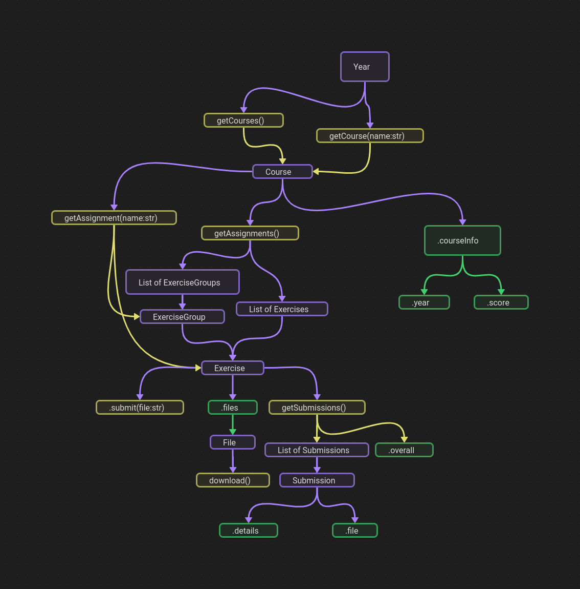

    

A python library which interacts with themis. Uses bs4. I'll try to end development on a somewhat working state. 

## Intended Features
* [x] Log in  
* [x] Submit
* [x] Bulk download of test cases and files
* [ ] Submission status
* [ ] Classes, methods and attributes described in the map below

## Docs
[here](http://temmies.rtfd.io/).

## Class map

## Possible continuations
* [ ] Discord bot
* [ ] CLI program

## Thanks to
* [Glitchcat](https://glitchcat.github.io/themis-api/), cool docs bro.
* [Mo](https://github.com/Stylo2k), damn bruh you actually work for Themis